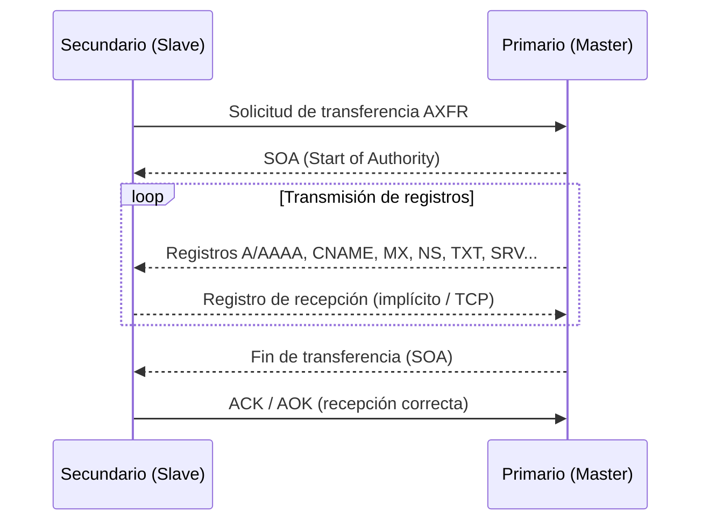

# Transferencias de zona DNS (Apuntes rápidos)

## Idea clave
Una **transferencia de zona (AXFR/IXFR)** es la copia de todos (o parte de) los registros DNS de una zona desde el **servidor primario** al **secundario**.
Es necesaria para redundancia y coherencia, pero si está mal configurada puede filtrar **todos los subdominios, IPs y metadatos DNS**.

## ¿Qué es una transferencia de zona?
- **AXFR (Full Zone Transfer):** copia completa de la zona.
- **IXFR (Incremental Zone Transfer):** solo los cambios desde un número de serie concreto.
- El flujo típico incluye: solicitud, envío del **SOA**, transmisión de registros y confirmación final.

## Diagrama del proceso (Mermaid)


## ¿Por qué es una vulnerabilidad?
Si el servidor autoritativo permite AXFR a **cualquiera**, un tercero puede descargar el **archivo de zona completo** y obtener:
- **Subdominios:** incluyendo entornos de pruebas, admin, dev, etc.
- **Direcciones IP:** objetivos potenciales para reconocimiento o ataque.
- **Registros NS y metadatos:** proveedor, topología, posibles errores de configuración.

> Nota legal: realiza pruebas **solo con autorización expresa**. Un intento no autorizado puede ser ilegal.

## Comandos clave (ofensivo con autorización)
### 1) `dig` (recomendado)
```bash
# Sintaxis general
dig axfr @<ns_autoritativo> <dominio>

# Ejemplo de demostración pública
dig axfr @nsztm1.digi.ninja zonetransfer.me
```

### 2) `host` (histórico)
```bash
# Requiere servidor NS y puede estar deshabilitado en muchas distros
host -l <dominio> <ns_autoritativo>
```

### 3) `nmap` (script NSE)
```bash
# Prueba de transferencia en todos los NS descubiertos
nmap -p 53 --script=dns-zone-transfer --script-args=dns-zone-transfer.domain=<dominio> <ip_o_rango>
```

### 4) `dig` con opciones útiles
```bash
# Ver solo el SOA (útil para decidir si intentar IXFR)
dig @<ns> <dominio> SOA +noall +answer

# Intentar transferencia incremental (si conoces el serial)
# Nota: IXFR requiere soporte del servidor y del cliente
dig ixfr=2025010101 @<ns> <dominio>
```

## Ejemplo real de demostración (salida recortada)
```bash
; <<>> DiG 9.x <<>> axfr @nsztm1.digi.ninja zonetransfer.me
zonetransfer.me.      7200 IN SOA nsztm1.digi.ninja. robin.digi.ninja. 2019100801 172800 900 1209600 3600
zonetransfer.me.       300 IN HINFO "Casio fx-700G" "Windows XP"
zonetransfer.me.       301 IN TXT "google-site-verification=..."
zonetransfer.me.      7200 IN MX   0 ASPMX.L.GOOGLE.COM.
_acme-challenge.zonetransfer.me. 301 IN TXT "6Oa05hbUJ9xSsvYy7pApQ..."
_sip._tcp.zonetransfer.me. 14000 IN SRV 0 0 5060 www.zonetransfer.me.
...
;; WHEN: Mon May 27 18:31:35 BST 2024
;; XFR size: 50 records (messages 1, bytes 2085)
```

## Indicadores de mala configuración
- AXFR responde desde Internet a clientes no listados.
- Falta de **ACL** por IP o TSIG en los NS autoritativos.
- Respuestas inconsistentes entre NS (solo algunos permiten AXFR).

## Remediación (defensa)
- **Restringir AXFR** solo a NS secundarios de confianza mediante **ACL** por IP.
- Usar **TSIG** (claves compartidas) para autenticar y firmar transferencias.
- Preferir **IXFR** y minimizar la ventana de exposición.
- Monitorizar y alertar intentos de AXFR no autorizados.
- Verificar periódicamente desde fuera (auditoría externa).
- Si es posible, **deshabilitar AXFR** público en NS externos y usar canales privados entre máster–esclavos.

## Comprobaciones defensivas (administrador)
```bash
# BIND/named.conf.options o named.conf.local (ejemplo ACL)
acl segundarios { 192.0.2.10; 198.51.100.20; };
zone "ejemplo.com" IN {
  type master;
  file "/etc/bind/db.ejemplo.com";
  allow-transfer { segundarios; };
  also-notify { 192.0.2.10; 198.51.100.20; };
};

# Ver logs de intentos de AXFR
journalctl -u named | grep AXFR
```


